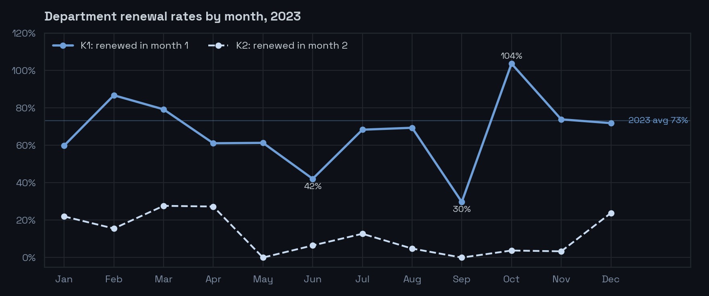
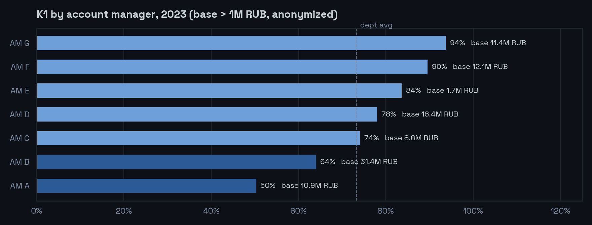

<p align="center">
  
</p>

## Business question

An advertising department sells contracts that end on a known month. Management needs a monthly report that answers two questions: **how much of the expiring revenue do we renew, and which account managers do it best?**

The raw data arrived as two messy spreadsheet exports, so the task was both a data-cleaning and a metrics-design problem.

## Metrics

| Metric | Definition |
|---|---|
| **K1** | Revenue renewed in the month right after the contract's last month ÷ revenue of the last month |
| **K2** | Revenue renewed in the second month after the last month ÷ revenue of the last month, for contracts not renewed in month 1 |

Both are calculated on revenue (not contract count), at contract level first and then aggregated by account manager and by department. Months without a real base are excluded, so a 0% never appears where there was nothing to renew.

## Results

<p align="center"></p>

- **K1 for 2023 is 73%**: most expiring revenue is renewed immediately.
- **K2 adds only 10%** of the remaining base, so a contract not renewed in month 1 is usually lost. The renewal effort should be front-loaded.
- **Seasonality is strong.** K1 drops to 42% in June and 30% in September, then jumps to 104% in October, meaning clients renewed with bigger budgets than before.

<p align="center"></p>

- **Managers range from 50% to 94% K1.** Top performers are worth studying, and their practices can be shared with the team.
- **The largest portfolio (31.4M RUB base) sits below the department average at 64%.** Bringing it up to the 73% average would add about 2.9M RUB of renewed revenue a year, the biggest single lever in the data.

## What the notebook does

1. **Cleans the exports.** Normalizes Russian month headers (`Ноябрь 2022` → `2022-11`), parses amounts with spaces and decimal commas, drops empty and invalid rows.
2. **Applies business rules.** Excludes contracts marked `стоп` / `end` before or in their last month; for months marked `в ноль` (zero payment), takes the amount from the previous month so the base is not understated.
3. **Calculates K1 and K2** per contract with a correct numerator and denominator, then aggregates by manager × month and by department.
4. **Builds management outputs:** clean pivot tables (only cells with a real base), annual manager ranking, a base-size diagnostic and charts with comments for the head of department.

A finished PDF report for management is included in the repository.

## Repository structure

```
├── DataAnalyst.ipynb      # full analysis: cleaning, K1/K2, tables, charts
├── financial_data.csv     # monthly revenue by contract (raw export)
├── prolongations.csv      # contract end month and account manager
├── report.pdf             # final report for management
├── images/                # charts for this README
└── requirements.txt
```

## How to run

```bash
pip install -r requirements.txt
jupyter notebook DataAnalyst.ipynb
```

Run all cells top to bottom; the CSV files are read from the repository root.

## Stack

Python · pandas · NumPy · Matplotlib · seaborn · Jupyter
